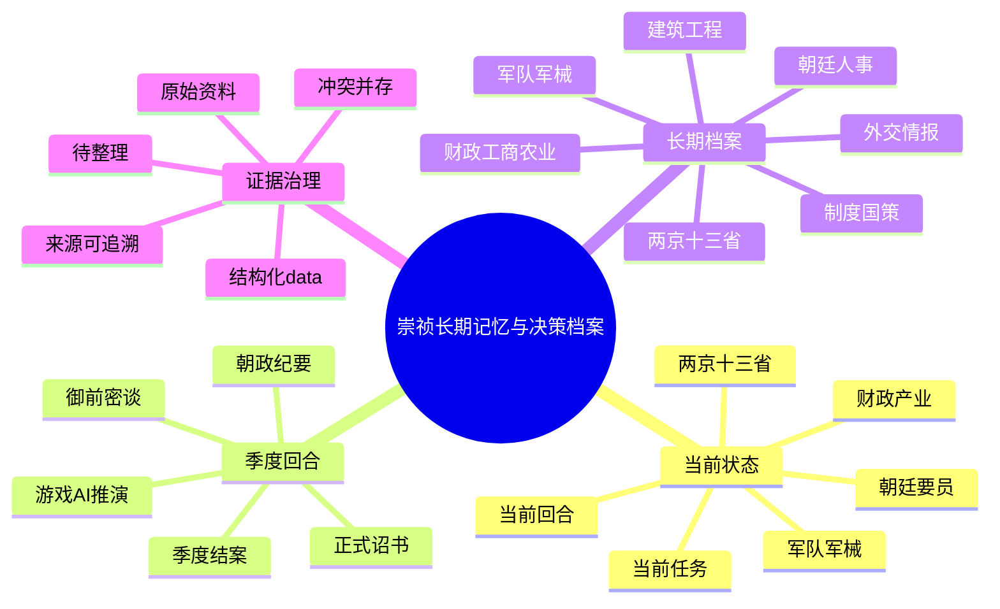
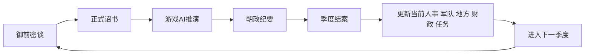

# 仓库思维导图

> 当前真实时间：崇祯十二年春执行中，尚未进入十二年夏。

```mermaid
mindmap
  root((崇祯长期记忆与决策档案))
    当前状态
      当前回合
      朝廷要员
      军队军械
      两京十三省
      财政产业
      当前任务
    季度回合
      御前密谈
      正式诏书
      游戏AI推演
      朝政纪要
      季度结案
    长期档案
      朝廷人事
      军队军械
      两京十三省
      财政工商农业
      建筑工程
      外交情报
      制度国策
    证据治理
      原始资料
      待整理
      结构化data
      冲突并存
      来源可追溯
```

```mermaid
flowchart LR
    A[御前密谈] --> B[正式诏书]
    B --> C[游戏AI推演]
    C --> D[朝政纪要]
    D --> E[季度结案]
    E --> F[更新当前人事 军队 地方 财政 任务]
    F --> G[进入下一季度]
    G --> A
```

核心边界：密谈是思考过程，诏书是正式输入，朝政纪要是游戏结果，季度结案是档案整理，当前状态是可追溯快照。五者不得互相覆盖。
