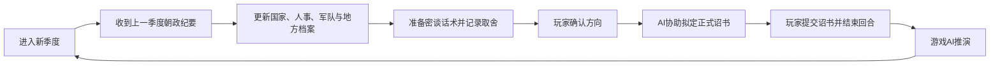

# 崇祯模拟器辅助管理系统

这是《历史模拟器：崇祯》的个人政务档案库，用来管理季度报告、密谈准备、玩家诏书、执行结果、人事、军队、地方、财政和长期战略。仓库不连接游戏，不自动提交诏书；AI可以读取、核对、分析和起草，最终决策与提交仍由玩家完成。

> AI阅读本仓库时，请直接在线读取下列入口文件，不要先下载、克隆或复制整个仓库。只有需要修改并提交资料时，才进行本地同步。

## 当前状态

- 当前游戏时间：**崇祯十二年春季，正在执行中**。
- 尚未进入：崇祯十二年夏季。
- 最近完成且已有正式反馈的季度：崇祯十一年冬季。
- 当前档案版本：`CZ12-SPRING-IN-PROGRESS-1`。
- 十二年春的密谈、正式诏书和执行跟踪尚未补齐；任何 AI 均不得自行假定这些材料已经存在。

## AI强制读档顺序

1. [`CURRENT_ARCHIVE.md`](CURRENT_ARCHIVE.md)：唯一当前入口与事实优先级。
2. [`data/archive_manifest.json`](data/archive_manifest.json)：当前档案清单。
3. [`data/current_snapshot.json`](data/current_snapshot.json)：十二年春进入时快照。
4. [`data/personnel_current.json`](data/personnel_current.json)：当前有效人事与空缺、冲突。
5. [`data/current_directives.json`](data/current_directives.json)：仍在执行或待验收的政令。
6. [`大明档案/00_总览/资料地图.md`](大明档案/00_总览/资料地图.md)：资料分别存放在哪里。
7. [`大明档案/00_总览/战略项目台账.md`](大明档案/00_总览/战略项目台账.md)：过去拟定过什么、现在进行到哪一步。
8. [`大明档案/01_季度政务/05_当前工作台/崇祯十二年/春季/README.md`](大明档案/01_季度政务/05_当前工作台/崇祯十二年/春季/README.md)：本季度工作入口。
9. [`大明档案/03_国策与战略/01_制度规则/关键制度源头/01_长期国策有效清单.md`](大明档案/03_国策与战略/01_制度规则/关键制度源头/01_长期国策有效清单.md)：哪些制度仍跨季有效。
10. [`大明档案/03_国策与战略/02_战略方针/README.md`](大明档案/03_国策与战略/02_战略方针/README.md)：年度、跨季方向与历史计划。
11. [`大明档案/03_国策与战略/04_国策设计/README.md`](大明档案/03_国策与战略/04_国策设计/README.md)：新国策的设计、试行、转正和退出规则。
12. 需要追溯时，再读取对应季度的诏书、密谈记录、朝政纪要和历史快照。

所有 AI 在引用数字前还必须阅读 [`五层证据模型.md`](大明档案/00_总览/五层证据模型.md)，先确认它是计划、诏书、游戏结果、当前事实还是事后修订。

远程协作 AI 的完整流程与固定输出格式见 [`AI协作与季度闭环操作手册.md`](大明档案/00_总览/AI协作与季度闭环操作手册.md)。在线阅读资料即可；不要在未被要求修改仓库时先下载、克隆或复制整个项目。

旧 `game_state.json`、`personnel.json` 中仍保留历史兼容数据。它们不得覆盖上述当前快照；同一事实冲突时，以最新正式纪要、最新诏书、当前快照和总控台冲突清单为准。

## 季度闭环



完整思维导图见 [`大明政务档案思维导图.md`](大明档案/00_总览/大明政务档案思维导图.md)，命名和归档规则见 [`季度闭环与命名规则.md`](大明档案/00_总览/季度闭环与命名规则.md)。

### 网页季度工作单

本地网页新增“季度闭环”页面，用一个工作单承接本季材料：

1. 粘贴上一季朝政纪要或反馈来源；
2. 记录本季问题、密谈对象、分歧和可行性；
3. 将政令草稿按军事、内政、外交、其他四板块分别保存；
4. 玩家确认并实际提交后，粘贴正式诏书并勾选“玩家确认已下诏”；
5. 下季收到游戏反馈后，再粘贴纪要并列出数据回填清单。

工作单保存到 [`data/quarterly_workflows.json`](data/quarterly_workflows.json)，同时生成该季度工作台内的 `季度闭环工作单.md`。它只保存协作材料，不自动生成诏书、不替玩家提交、更不会把草稿或预计结果写成事实。

页面的“复制协作 AI 提示词”会生成当前工作单对应的提示；外部 AI 需要先在线读档，再帮助完成密谈、核验、草稿和后续回填。

## 核心资料区

- `大明档案/01_季度政务/05_当前工作台/`：每季按“上季反馈 → 密谈 → 正式诏书 → 执行跟踪”推进。
- `大明档案/01_季度政务/02_诏书/`：玩家最终采用并提交的诏书。
- `大明档案/01_季度政务/01_密谈/`：拟诏前与大臣讨论的话术、分歧和取舍。
- `大明档案/01_季度政务/03_朝政纪要/`：游戏 AI 对上一季诏书的推演结果和季度报告。
- `大明档案/02_国家档案/01_朝臣/`：朝廷要员、职务、负责人、署理与空缺。
- `大明档案/02_国家档案/02_军队/`：军队编制、主将、军械、缺口与战备。
- `大明档案/02_国家档案/03_国家态势/`：省级民心、动乱、赋税、灾害、综合面板和军械库存。
- `大明档案/03_国策与战略/01_制度规则/关键制度源头/`：长期有效制度及其源流，不混入当季指标。
- `大明档案/03_国策与战略/02_战略方针/`：年度与跨季方向，到期后转为历史。
- `大明档案/03_国策与战略/03_已执行方案/`：玩家确认曾采用或执行过的历史方案；其中目标值仍须与实际反馈分开。
- `大明档案/03_国策与战略/04_国策设计/`：新长期国策、制度改版与废止提案的唯一工作区。
- `大明档案/03_国策与战略/05_玩家笔记/`：玩家战略教训、偏好和未成形想法。
- `大明档案/01_季度政务/04_执行任务/`：当季目标、限时试行和督办原稿，未经续行不自动跨季。
- `大明档案/03_国策与战略/90_历史策略镜像/`：旧策略 JSON 的历史兼容镜像，不是当前长期国策入口。
- `大明档案/99_原始资料/`：无法确认时间、重复稿或同步前本地同名稿；只作证据，不作当前事实。
- `data/`：供程序和 AI 精确读取的 JSON 快照、索引与兼容数据。

整理新国策时，可调用项目内本地 Skill：`$design-imperial-policy`。它会先区分长期制度、跨季战略、当季任务和历史已执行方案，再按证据层级保存；不会自动替玩家决定或执行。

## 本地 Skills

| Skill | 用途 |
|---|---|
| `$writeimperial` | 完整读档、密谈、Scale v3.1 目标计算、四段诏书与季度反馈闭环 |
| `$writeimperial-compact` | 将已成立的政策逻辑压缩为紧凑诏书或政令段落 |
| `$writeimperial-causal-ledger` | 为资源、生产、收入、成本、分配和面板结果建立可倒查的因果合同 |
| `$design-imperial-policy` | 设计、试行、复核和归档新的长期国策 |

因果合同规则的历史归档稿仍保存在 `大明档案/03_国策与战略/01_制度规则/AI起草与档案规则/政令与诏书技能规则归档稿.md`；正式可调用版本位于 `skills/writeimperial-causal-ledger/SKILL.md`。

## 事实与操作边界

- 正式朝政纪要记录“发生了什么”；正式诏书记录“玩家下达了什么”；计划和密谈只记录“准备做什么”。三者不得混写。
- 无实际数按未完成；名册不等于到任，编制不等于实点，产能不等于产量，署理不等于正式任命。
- 冲突数值并存并标注来源，不擅自挑选更好看的数字。
- AI可以在玩家明确要求时分析、拟密谈话术和起草诏书，但不得自行提交、执行或篡改游戏结果。
- 原始历史诏书和朝政纪要只移动、重命名和建立索引，不改正文。
- “计划造500门”和“实际新增15门”是两条记录；“下令授旗”和“反馈确认授旗”也是两条记录，任何情况下均不得用前者覆盖后者。

## 本地使用

```powershell
git clone "https://github.com/archibald80000-ai/moni-ceshi-guanli-xitong.git"
cd ".\moni-ceshi-guanli-xitong"
git pull
python main.py
```

网页版可运行 `启动网页版.cmd`。公开仓库地址：<https://github.com/archibald80000-ai/moni-ceshi-guanli-xitong>。

## 给其他 AI 的最短指令

```text
请直接在线读取本仓库 README.md、CURRENT_ARCHIVE.md、data/current_snapshot.json、data/current_directives.json、data/personnel_current.json、data/quarterly_workflows.json 与大明档案/00_总览/五层证据模型.md，不要先下载整个仓库。先区分 L1计划、L2诏书、L3游戏结果、L4当前状态和L5修订；再按“密谈与可行性 → 四板块草稿 → 玩家确认后正式诏书 → 下季纪要数据回填”协作。不要自动提交游戏，也不要把计划或推演写成发生的事实。
```
