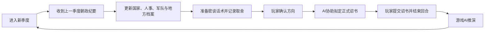

# 崇祯模拟器辅助管理系统

这是《历史模拟器：崇祯》的个人政务档案库，用来管理季度报告、密谈准备、玩家诏书、执行结果、人事、军队、地方、财政和长期战略。仓库不连接游戏，不自动提交诏书；AI可以读取、核对、分析和起草，最终决策与提交仍由玩家完成。

> AI阅读本仓库时，请直接在线读取下列入口文件，不要先下载、克隆或复制整个仓库。只有需要修改并提交资料时，才进行本地同步。

## 当前状态

- 当前游戏时间：**崇祯十二年春季，正在执行中**。
- 尚未进入：崇祯十二年夏季。
- 最近完成且已有正式反馈的季度：崇祯十一年冬季。
- 当前档案版本：`CZ12-SPRING-IN-PROGRESS-1`。
- 十二年春的密谈、正式诏书和执行跟踪尚未补齐；任何 AI 均不得自行假定这些材料已经存在。

## AI强制读档顺序

1. [`CURRENT_ARCHIVE.md`](CURRENT_ARCHIVE.md)：唯一当前入口与事实优先级。
2. [`data/archive_manifest.json`](data/archive_manifest.json)：当前档案清单。
3. [`data/current_snapshot.json`](data/current_snapshot.json)：十二年春进入时快照。
4. [`data/personnel_current.json`](data/personnel_current.json)：当前有效人事与空缺、冲突。
5. [`data/current_directives.json`](data/current_directives.json)：仍在执行或待验收的政令。
6. [`大明档案/00_总控台/资料地图.md`](大明档案/00_总控台/资料地图.md)：资料分别存放在哪里。
7. [`大明档案/00_总控台/战略项目台账.md`](大明档案/00_总控台/战略项目台账.md)：过去拟定过什么、现在进行到哪一步。
8. [`大明档案/回合工作台/崇祯十二年/春季/README.md`](大明档案/回合工作台/崇祯十二年/春季/README.md)：本季度工作入口。
9. 需要追溯时，再读取对应季度的诏书、密谈记录、朝政纪要和历史快照。

所有 AI 在引用数字前还必须阅读 [`五层证据模型.md`](大明档案/00_总控台/五层证据模型.md)，先确认它是计划、诏书、游戏结果、当前事实还是事后修订。

旧 `game_state.json`、`personnel.json` 中仍保留历史兼容数据。它们不得覆盖上述当前快照；同一事实冲突时，以最新正式纪要、最新诏书、当前快照和总控台冲突清单为准。

## 季度闭环



完整思维导图见 [`大明政务档案思维导图.md`](大明档案/00_总控台/大明政务档案思维导图.md)，命名和归档规则见 [`季度闭环与命名规则.md`](大明档案/00_总控台/季度闭环与命名规则.md)。

## 核心资料区

- `大明档案/回合工作台/`：每季按“上季反馈 → 密谈 → 正式诏书 → 执行跟踪”推进。
- `大明档案/诏书全集/`：玩家最终采用并提交的诏书。
- `大明档案/密谈记录/`：拟诏前与大臣讨论的话术、分歧和取舍。
- `大明档案/朝政纪要/`：游戏 AI 对上一季诏书的推演结果和季度报告。
- `大明档案/朝臣档案/`：朝廷要员、职务、负责人、署理与空缺。
- `大明档案/军队档案/`：军队编制、主将、军械、缺口与战备。
- `大明档案/地方档案/`：省级民心、动乱、赋税、灾害和地方负责人。
- `大明档案/国家态势/`：各季度综合面板和军械库存。
- `大明档案/战略方略/`、`年度国策/`、`季度目标/`：长期方案、年度路线和当季目标。
- `大明档案/99_原始资料/`：无法确认时间、重复稿或同步前本地同名稿；只作证据，不作当前事实。
- `data/`：供程序和 AI 精确读取的 JSON 快照、索引与兼容数据。

## 事实与操作边界

- 正式朝政纪要记录“发生了什么”；正式诏书记录“玩家下达了什么”；计划和密谈只记录“准备做什么”。三者不得混写。
- 无实际数按未完成；名册不等于到任，编制不等于实点，产能不等于产量，署理不等于正式任命。
- 冲突数值并存并标注来源，不擅自挑选更好看的数字。
- AI可以在玩家明确要求时分析、拟密谈话术和起草诏书，但不得自行提交、执行或篡改游戏结果。
- 原始历史诏书和朝政纪要只移动、重命名和建立索引，不改正文。
- “计划造500门”和“实际新增15门”是两条记录；“下令授旗”和“反馈确认授旗”也是两条记录，任何情况下均不得用前者覆盖后者。

## 本地使用

```powershell
git clone "https://github.com/archibald80000-ai/moni-ceshi-guanli-xitong.git"
cd ".\moni-ceshi-guanli-xitong"
git pull
python main.py
```

网页版可运行 `启动网页版.cmd`。公开仓库地址：<https://github.com/archibald80000-ai/moni-ceshi-guanli-xitong>。
