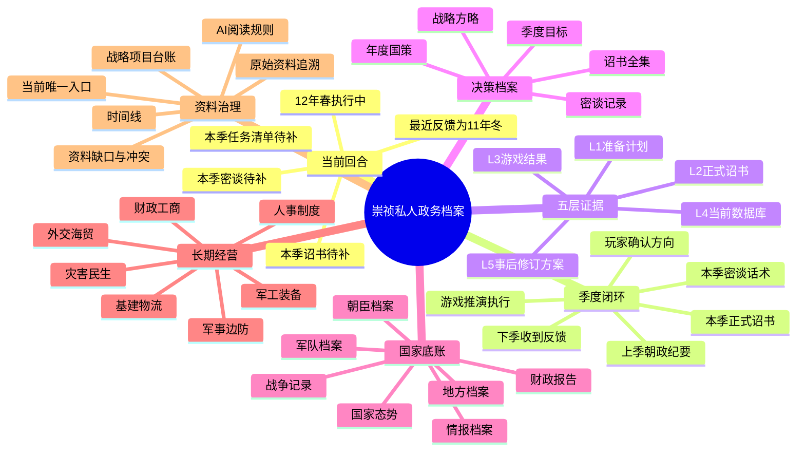
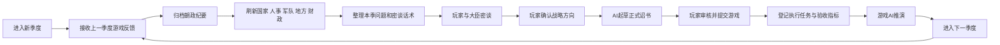
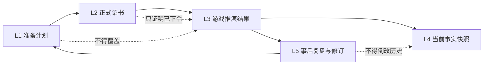

# 大明政务档案思维导图

> 当前定位：崇祯12年春季执行中。此图只说明资料关系，不替代季度事实。

## 季度工作流

## 三份核心材料

每个季度至少应形成以下三份正式材料：

1. **密谈话术**：记录要问哪些大臣、验证哪些数字、有哪些备选路线。
2. **正式诏书**：记录玩家最终确认并提交游戏的命令。
3. **朝政纪要**：记录游戏AI在下一季度给出的真实推演结果和数值变化。

战略方案、年度国策和个人想法可以支持决策，但不得代替上述三份材料。

## 五层流转

详细规则与红夷炮、靖边军团实例见 `五层证据模型.md`。
