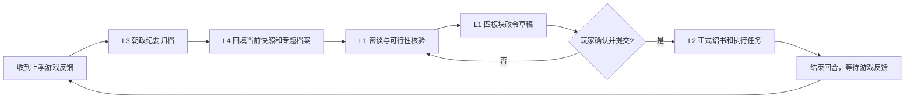

# AI协作与季度闭环操作手册

本手册把仓库作为游戏外的长期记忆、事实校验和决策工作台。它不连接游戏，不会自动提交诏书，也不会把 AI 推演写成游戏已发生的事实。

## 一、远程 AI 在线阅读顺序

公开仓库中的协作 AI 应直接在线读取，不必先下载、克隆或复制整个仓库：

1. `README.md` 与 `CURRENT_ARCHIVE.md`：当前时间、边界和资料优先级。
2. `data/archive_manifest.json`、`data/current_snapshot.json`、`data/current_directives.json`、`data/personnel_current.json`：当前机器可读口径。
3. `大明档案/00_总览/五层证据模型.md`：先判定资料是计划、诏书、结果、当前状态还是修订稿。
4. `data/quarterly_workflows.json` 与本季 `大明档案/01_季度政务/05_当前工作台/<年份>/<季节>/季度闭环工作单.md`：读取本轮已提供材料及缺口。
5. 仅在需要追溯时，继续读取对应的密谈、正式诏书、朝政纪要、军队、人事、地方与战略专题资料。

不要把旧兼容数组 JSON 当作当前事实，也不要因为工作单中有草稿就假定诏书已经提交。

## 二、每季标准流程



网页“季度闭环”会把这些内容保存到 `data/quarterly_workflows.json`，并在当前季工作台生成 `季度闭环工作单.md` 镜像。该镜像是协作材料，不自动替代正式诏书或朝政纪要。

## 三、协作 AI 的固定输出

收到玩家的季度材料后，按下列顺序输出：

1. **事实表**：逐条标注 `L1_PLAN`、`L2_ORDER`、`L3_RESULT`、`L4_STATE` 或 `L5_REVISION`，写明来源路径和不确定项。
2. **密谈方案**：使用 `$imperial-council-dialogue` 生成皇帝口吻的开题问话、二轮追问或主责—协办—制衡—验收协同问话；列出应咨询的朝臣、每位应问的问题、可能的分歧、依赖条件和取舍；不能把密谈建议说成已决定政策。
3. **可行性核验**：核对钱粮、人员、兵额、既有机构、时限、风险、失败线，以及是否违反长期制度或仍在执行的政令。
4. **四板块政令草稿**：玩家确认密谈方向后，再用 `$writeimperial` 形成军事、内政、外交、其他草稿。每条写清负责人、资源、时限、验收与失败线；复杂生产和收益事项要使用 `writeimperial-causal-ledger` 的因果账本。
5. **正式诏书**：只有玩家明确说“采用/确认/已提交”后才合并草稿；正式诏书只记录命令，不预写结果。
6. **下季反馈回填**：收到游戏纪要后，分离实际增量、期末库存、产能、订单、拨款和未完成项；列出要更新的 JSON、专题档案、当前快照和冲突清单。

## 四、给协作 AI 的可复制提示词

```text
你是本仓库的档案协作 AI。请直接在线阅读 README.md、CURRENT_ARCHIVE.md、data/archive_manifest.json、data/current_snapshot.json、data/current_directives.json、data/personnel_current.json、data/quarterly_workflows.json 和大明档案/00_总览/五层证据模型.md；不要先下载整个仓库。

先判定每条材料的证据层级；先用 `$imperial-council-dialogue` 输出皇帝口吻的密谈问题、二轮追问或协同分工与可行性，再输出军事/内政/外交/其他四板块政令草稿、待玩家确认的正式诏书方案、收到下季纪要后的数据回填清单。不得自动提交游戏，不得把计划、诏书、订单、拨款、产能或推演写成实际游戏结果。
```

## 五、回填规则

- `L1` 密谈、战略、草稿：写入工作单、密谈记录、计划或玩家笔记。
- `L2` 玩家实际提交的文本：写入正式诏书与执行任务；勾选“玩家确认已下诏”。
- `L3` 游戏返回的纪要、截图或面板：写入朝政纪要及对应专题数据。
- `L4` 只有可追溯到 L3 的数据，才能进入 `current_snapshot.json`、`personnel_current.json`、当前军队/地方档案。
- L3 与旧数冲突时，两者并存并登记 `资料缺口与冲突清单.md`，不得无说明覆盖。
