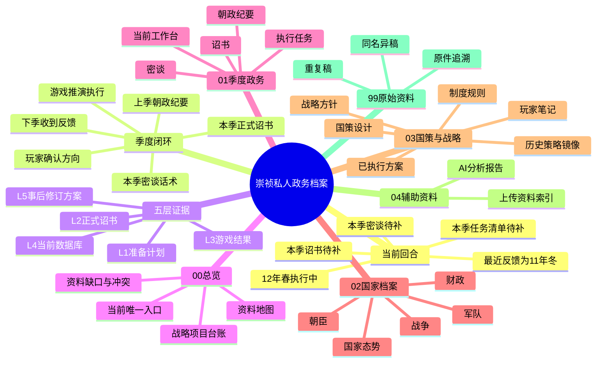
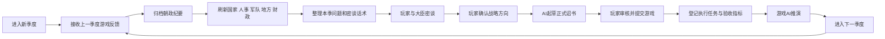
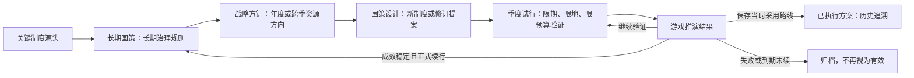
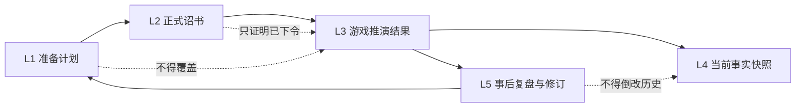

# 大明政务档案思维导图

> 当前定位：崇祯12年春季执行中。此图只说明资料关系，不替代季度事实。

## 季度工作流

## 三份核心材料

每个季度至少应形成以下三份正式材料：

1. **密谈话术**：记录要问哪些大臣、验证哪些数字、有哪些备选路线。
2. **正式诏书**：记录玩家最终确认并提交游戏的命令。
3. **朝政纪要**：记录游戏AI在下一季度给出的真实推演结果和数值变化。

长期国策、战略方针、国策设计、历史已执行方案和个人想法可以支持决策，但不得代替上述三份材料。

## 制度、战略与试行的关系

- **长期国策**回答“长期按什么制度治理”，未被正式修订、暂停或废止前持续有效。
- **战略方针**回答“未来一年或若干季度优先把资源投向哪里”，到期必须复核。
- **国策设计**回答“准备建立、修订或废止什么长期规则”，未经正式诏书和反馈验证时仍是提案。
- **已执行方案**保存玩家确认曾采用过的历史路线，但其中命令目标不自动等于实际结果。
- **季度试行**回答“本季先在哪里、花多少、由谁验证”，默认到期，不自动升级为长期国策。
- **AI/档案规则**只约束资料读取和起草方法，不是游戏内政令。

权威入口见：`../03_国策与战略/01_制度规则/关键制度源头/00_制度源流总览.md`、`../03_国策与战略/01_制度规则/关键制度源头/01_长期国策有效清单.md`、`../03_国策与战略/01_制度规则/关键制度源头/02_季度试行与非永久政策清单.md`。

## 五层流转

详细规则与红夷炮、靖边军团实例见 `五层证据模型.md`。
