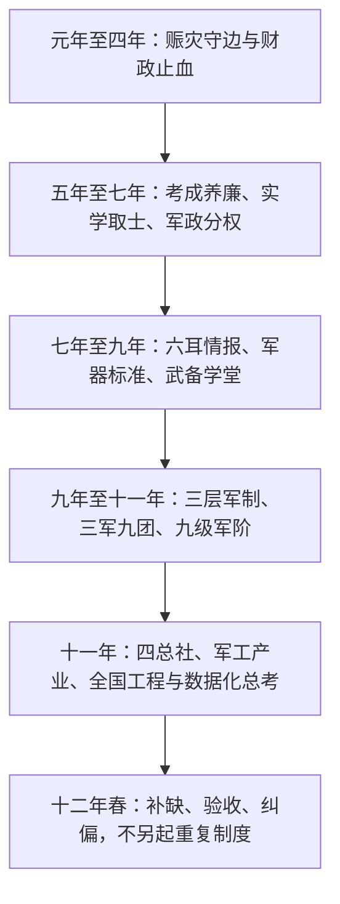

# 关键制度源流总览

> 当前判定时间：崇祯12年春季执行中
>
> 最近结果依据：崇祯11年冬季朝政纪要
>
> 用途：回答“这项制度从哪里提出、何时下诏、是否仍有效、实际结果是什么”。

## 一、先分清五种资料

| 类别 | 回答的问题 | 是否自动影响当前国策 | 目录 |
|---|---|---|---|
| 长期国策／制度 | 国家以后按什么规则运行 | 是，直至废止、修订或被新制度取代 | `制度规则/关键制度源头/` |
| 战略方针 | 未来一年或数季优先往哪里走 | 否；到期后转为历史方针 | `战略方针/` |
| 战略方略 | 某一领域准备采用什么打法 | 否；须进入正式诏书才成为命令 | `战略方略/` |
| 季度试行 | 本季、某地或某额度先试什么 | 否；期满必须复核、续期、固化或终止 | `季度目标/` |
| AI／档案规则 | AI怎样读档、算目标、写诏书 | 不属于游戏内国策 | `制度规则/AI起草与档案规则/` |

正式诏书属于 `L2_ORDER`，证明命令已经下达；朝政纪要属于 `L3_RESULT`，证明实际发生。长期制度原稿即使真实且曾进入执行，也不能单独证明其中所有目标已经完成。

## 二、制度演进总图

## 三、九条关键制度源流

### 1. 实际数考成与档案证据制度

- 源头：考成养廉纲要提出“三册六核十二目”，要求钱粮、政务、军政按季具报。
- 制度化：九年春《国家预警、纠错与韧性建设章程》加入御前总数、四数分列、失败案、政策沙盒和机构日落。
- 后续强化：九年至十一年诏书反复要求基线、投入、实际、完成率、凭证和判定。
- 十一年冬结果：明确库存不得算销售、产能不得算产量、开工不得算完工、定金不得算实收。
- 当前判定：**已成长期底层制度**。

源文件：[20_治理_国家预警纠错与韧性建设章程原稿.md](20_治理_国家预警纠错与韧性建设章程原稿.md)

### 2. 铨选、考成与养廉合一

- 源头：《考成养廉五年纲要》提出考成、俸禄与养廉挂钩，实学科举补官。
- 章程：《铨选考成养廉合一章程》规定造册、核验、任务考程、九品评等与待遇。
- 二次修正：九年春优化为主业、质量持续、廉洁扰民三目，并把权力分成定策、执行、财计、公开稽核、密侦、司法六类。
- 后续制度：九年秋整饬兼差，十年秋补六部堂官，十一年春夏形成六部、九品考成、季度实务科举与官员责任册。
- 当前判定：**长期有效，但旧“统一底线加30%、上考加50%”已被 Scale v3.1 取代**。

源文件：[10_吏治_铨选考成养廉合一章程原稿.md](10_吏治_铨选考成养廉合一章程原稿.md)、[11_吏治_考成养廉五年纲要原稿.md](11_吏治_考成养廉五年纲要原稿.md)、[21_治理_九品考察与事权分管优化试行稿.md](21_治理_九品考察与事权分管优化试行稿.md)

### 3. 事权分离与四权互核

- 定策、执行、拨款、验收、审账、定罪不得集中于一人。
- 王承恩掌账不掌刑，法司定罪不掌账，都察院公开审计，李若琏等密核，内阁复核。
- 大额拨款实行双钥或多方签押；调查机关不得借查账夺银、扰民或自行定罪。
- 当前判定：**十一年冬诏书明定“四权互核恒久施行”**。

### 4. 三层军制、三军九团与九级军阶

- 九年秋：全国军队分为经制机动、边墙守备、屯田工程后勤三层；一军一籍、一军一役。
- 十一年春：三级军队与现代编制进一步固定，建立天枢、地维、人和三军及九军团。
- 十一年夏：军阶与实职分离，以任务、训练、军纪、保全、饷械和数据考到单位，以单位、专项和廉洁考到个人。
- 十一年冬结果：三军九团实到148690、满编99.3%，靖边已授旗；士官学校成为游戏国策效果。
- 当前判定：**主体已经成制，当前只补装备、训练和中枢缺口，不宜另造重复军制**。

源文件：[50_军制_皇明九级军阶与武备学堂长期章程原稿.md](50_军制_皇明九级军阶与武备学堂长期章程原稿.md)、[51_军政_六阁六部九级军阶与密谍阶段复核.md](51_军政_六阁六部九级军阶与密谍阶段复核.md)

### 5. 军器标准化、职业军官与技术教育

- 七项基础国策规定军器编号、试制五步法、逐件验收、标准操典和三级军官教育。
- 京西军械总厂、燧发枪、火炮、艺学局、武备学堂属于该制度的项目化执行。
- 十一年冬确认南北枪厂统一机件与验枪样式正在推进；红夷炮、线膛枪、野战炮仍须按实际产量和试射结果验收。
- 当前判定：**制度长期有效，具体厂数、产量和拨款属于项目或季度目标**。

源文件：[30_国本_七项基础国策实施章程原稿.md](30_国本_七项基础国策实施章程原稿.md)

### 6. 农战屯田、防灾仓储与民生兜底

- 常平仓、归屯、商屯、军屯、高产作物、井渠、水车、防疫药仓和以工代赈构成长期治理工具箱。
- 长期原则是灾区先粮、种、具、工，再谈征税；不以挪赈银、强迁、强役换取纸面成绩。
- 陕西免税至崇祯13年冬是有明确期限的跨季政策，不是永久零税。
- 浙江调粮修堤、某季免税额度和具体赈银属于季度处置。
- 当前判定：**治理体系长期有效，地区税率与拨款按期复核**。

### 7. 实学科举、五湖四海用人与基层言路

- 正科与实务特科并行，军事、财政、水利、刑名、火器、农学等以到岗实绩验收。
- 官员来源不以党派和门第决定，但须通过回避、复试、试任和季度考成。
- 言路、铜匦、民事申诉和邸报公开属于治理渠道，不能变成无证据兴狱。
- 当前判定：**长期有效；每季录取人数和专项赏银不是永久固定值**。

### 8. 有限开海、商税拓源与核心技术禁运

- 税源以市舶、盐课、矿课、真实商贸和产业增收为主，不以提高民田正税为默认手段。
- 开海只计实际交货、实收与实税；合同、预约、定金和在途货物另账。
- 炮图、火药方、钻镗法、母机和核心工匠不得出境。
- 十一年冬盐引重定产生季度盐茶课效果，属于持续税制调整；五港预约、琉璃售价和某季专项则属于项目执行。
- 当前判定：**有限开海与禁技长期有效；口岸、税率、品类和预算按季度诏书调整**。

### 9. 六耳巡核、锦衣密侦与辽东六线

- 六耳负责公开巡核、测绘、采情和分析，不审案、不征税、不调兵、不抄家。
- 锦衣负责暗线复核，但不得绕过法司定罪。
- 情报分级、双源验证、轮换、诱饵测试、来源保护与结果回流构成制度闭环。
- 辽东六线是十一年仍在执行的专项情报体系；它继承长期情报制度，但每条线的目标和赏银属于季度项目。
- 当前判定：**双层情报制度长期有效；具体密线随暴露、时效和战区变化调整**。

源文件：[40_情报_六耳巡核与锦衣密侦双层制度原稿.md](40_情报_六耳巡核与锦衣密侦双层制度原稿.md)

## 四、当前使用原则

1. 起草新诏书时先读 [01_长期国策有效清单.md](01_长期国策有效清单.md)，不要把已经存在的制度重新“创建”一次。
2. 再读 [02_季度试行与非永久政策清单.md](02_季度试行与非永久政策清单.md)，避免把过期税率、旧预算和旧上考公式带入当前季度。
3. 战略方针只决定当期优先级；要改变长期国策，必须在正式诏书中明确“修订、废止、并入或续行”。
4. 任何完成状态仍以朝政纪要、截图或游戏正式反馈为准。
